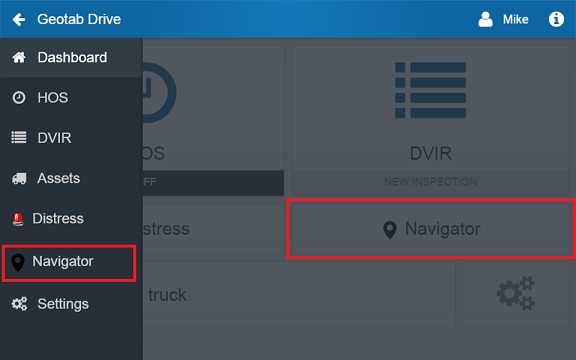

> Geotab Drive Add-Ins are in preview release and subject to change_

## Overview

The MyGeotab Add-In structure can be applied to the Geotab Drive application as well, providing you the ability to extend the functionality for drivers in an environment with sensors (e.g. geolocation and acceleration) and actuators (e.g. voice alerts and notifications). This environment must also been completely operable in an offline state — so your Add-In must be able to handle having no internet connection, or sleeping in the background of the mobile device.

Please read the [Developing Add-Ins](./developing-addins.md) guide first before attempting a Geotab Drive Add-In.

All Add-Ins that have been designed to work with MyGeotab will work on the Geotab Drive app as well. Your Add-In will be completely downloaded for all referenced links, images, and scripts upon user login. This way, as the user is authenticated over the internet — they will have your Add-In with them as they travel or disconnect from the network. If your Add-In requires dynamic loading of CSS, images, or JavaScript — these requests will fail if the user does not have a network connection. As such you should either: include all dependencies on creation of the Add-In, explicitly link to them, or provide a fallback if **state.online** returns False. Geotab Drive Add-Ins will also display differently, on both the dashboard and the menu.

 

To make an Add-In on the Geotab Drive app, the **item** in your configuration file must have a **path** that equals " **DriveAppLink/**" (including a trailing forward slash). The menuName, url, and version will remain unchanged. For example:

### Listing 1 — Geotab Drive "item" configuration

```json
"items": [{
 "version": "1.0",
 "url": "addinFile.html",
 "path": "DriveAppLink/",
 "menuName": {
  "en": "English Label",
  "fr": "French Label"
 }
}]
```

> The array of **items** also allows you to have one link item in MyGeotab, and another link item to Geotab Drive

## API and State Documentation

Inside the Geotab Drive app, we provide the same _api_ and _state_ properties for your initialize method that we do for our normal Add-Ins. In addition to this, we provide you with properties and methods to allow access to mobile device sensors/actuators. See Table 1 below for a list of the properties and methods provided in __api.mobile__.

### Table 1 — api.mobile device additional properties and methods

|   | **Description** | **Parameters** | **Return Type** |
| --- | --- | --- | --- |
| api.mobile.exists() | Returns `true` if Geotab Drive is running within a native application, and `false` if just as a HTML5 web application | None | Boolean |
| api.mobile.getVersion() | If `api.mobile.exists()`, gets the Geotab Drive version from the native application | None | String |
| api.mobile.speak() | If `api.mobile.exists()`, uses the text to speech functionality on the mobile device | String | Void |
| api.mobile.notify() | If `api.mobile.exists()`, will add a notification to the top bar of a native operating system Example: `api.mobile.notify("Fill up your vehicle", "Low on gas")` | String[Message], String[Title], String[Id], [String[JsonData]], [Boolean[Permanent]] | Void |
| api.mobile.geolocation() | A navigator object that is similar to HTML5 `navigator.geolocation` Example: `api.mobile.geolocation.getCurrentPosition(function (position) { }, function (error) { }, { enableHighAccuracy: true })` | None | None |

### Table 2 - api.mobile.user data methods
|   | **Description** | **Parameters** | **Return Type** |
| --- | --- | --- | --- |
| api.mobile.user.get() | By default returns all drivers & co-drivers. If __includeAllDrivers__ is set to __false__, it will return the user in the driver's seat | Boolean(includeAllDrivers=true) | User |
| api.mobile.user.setDriverSeat() | Will set the vehicle's driver to the user Id provided. Only works with user Id's that are logged in. Tries to perform a __Set<DriverChange>__ api call, or updates local database if offline | String(id) | User |
| api.mobile.user.getHosRuleSet() | Returns the configuration of the 'active' driver's current ruleset | None | RuleSet Configuration |
| api.mobile.user.getAvailability() | Returns the 'active' driver's availability hours | None | DutyStatusAvailability |
| api.mobile.user.getViolations() | Returns an array of violations the driver has since the start of their cycle | None | DutyStatusViolation |

### Table 3 - api.mobile.dutyStatusLog data methods
|   | **Description** | **Parameters** | **Return Type** |
| --- | --- | --- | --- |
| api.mobile.dutyStatusLog.get() | Returns array of 'active' driver's DutyStatusLogs | None | DutyStatusLog[] |
| api.mobile.dutyStatusLog.getCurrentDrivingLog() | Returns a single DutyStatusLog that is the driver's present "driving" status. Where "driving" is defined as D, ON, OFF, SB, WT logs. | None | DutyStatusLog |

### Table 4 - api.mobile.vehicle data methods
|   | **Description** | **Parameters** | **Return Type** |
| --- | --- | --- | --- |
| api.mobile.vehicle.get() | Returns current vehicle (Device) or null | None | Device / null |

### Table 5 - api.mobile.trailer data methods
|   | **Description** | **Parameters** | **Return Type** |
| --- | --- | --- | --- |
| api.mobile.trailer.get() | Returns array of current trailer(s) or an empty array | None | Trailer[] |

### Table 6 - api.mobile.shipment data methods
|   | **Description** | **Parameters** | **Return Type** |
| --- | --- | --- | --- |
| api.mobile.shipment.get() | Returns array of current shipment(s) or an empty array | None | ShipmentLog[] |

### Table 8 - state additional parameters
|   | **Description** | **Parameters** | **Return Type** |
| --- | --- | --- | --- |
| state.device | Get the current vehicle that is being connected to the mobile device | None | String |
| state.driving | Mobile device is detected as driving with the current vehicle | None | Boolean |
| state.charging | Mobile device is being powered | None | Boolean |
| state.background | Geotab Drive application is running in the background | None | Boolean |
| state.online | Mobile device has internet access | None | Boolean |
| state.deviceCommunicating | Telematics device is communicating to the server | None | Boolean |
| state.gpsConnected | Mobile device has GPS enabled | None | Boolean |

## Host Geotab Drive in WebView

It is possible to host the Geotab Drive application *within* an Android or iOS application's WebView. It is possible, today, for developers to do this but it is often requested that they have programmatic access to Geotab Drive's features in the WebView. For example: being able to get a driver's availability locally in the app and not having to make a Get<DutyStatusAvailability> call to the server. This will save server load, and make your application more stable in situations of poor network connectivity.

### Table 9 - Global access to Drive app
|   | **Description** | **Parameters** | **Return Type** |
| --- | --- | --- | --- |
| window.webViewLayer.getApiUserNames | Returns a list of all logged in users' names | None | String |
| window.webViewLayer.getApi | Accepting a userName, this will return the user's __api__ object. This is the same __api__ object described above, and has __api.mobile__ and all other attributes & methods | String(userName) | Object |

Use those global methods to get access to users' API objects and all the bells & whistles that have been extended into the Geotab Drive application.

### Table 9 - Global events
|   | **Description** | **Parameters** | **Return Type** |
| --- | --- | --- | --- |
| window.webViewLayer.pageNavigation | Register this function to be notified of page navigation within the Geotab Drive application | None | String |
| window.webViewLayer.newDutyStatusLog | Register this function to be notified when a new DutyStatusLog is created in Geotab Drive. It will return the whole object | None | Object |
| window.webViewLayer.driverActionNecessary | Register this function to be notified when the Geotab Drive application would like to be visually presented to the user. | None | None |


## Opening third-party applications using URI schema

> Drive app v4.1.0+

It's possible to open different applications like prontoforms or native calendar from add-ins. To do so, it's important to construct correct URI schema string and pass it to `window.open. For example:

```javascript
window.open(uriSchemaString, "_system")
```

Make sure to read carefully documentation of the app you're trying to open to use correct schema. For example, to open twitter application from addin you should use:

```javascript
window.open("twitter://messages", "_system")
```

You can't use just `twitter://` as it's not correct and app won't open. You need to specify which page you want to open: `messages`, `account` etc.

To open webpage you need to use the same method, but with this notation:

```javascript
window.open("https://google.com", "_blank")
```

> `_blank` is important, especially for iOS devices
